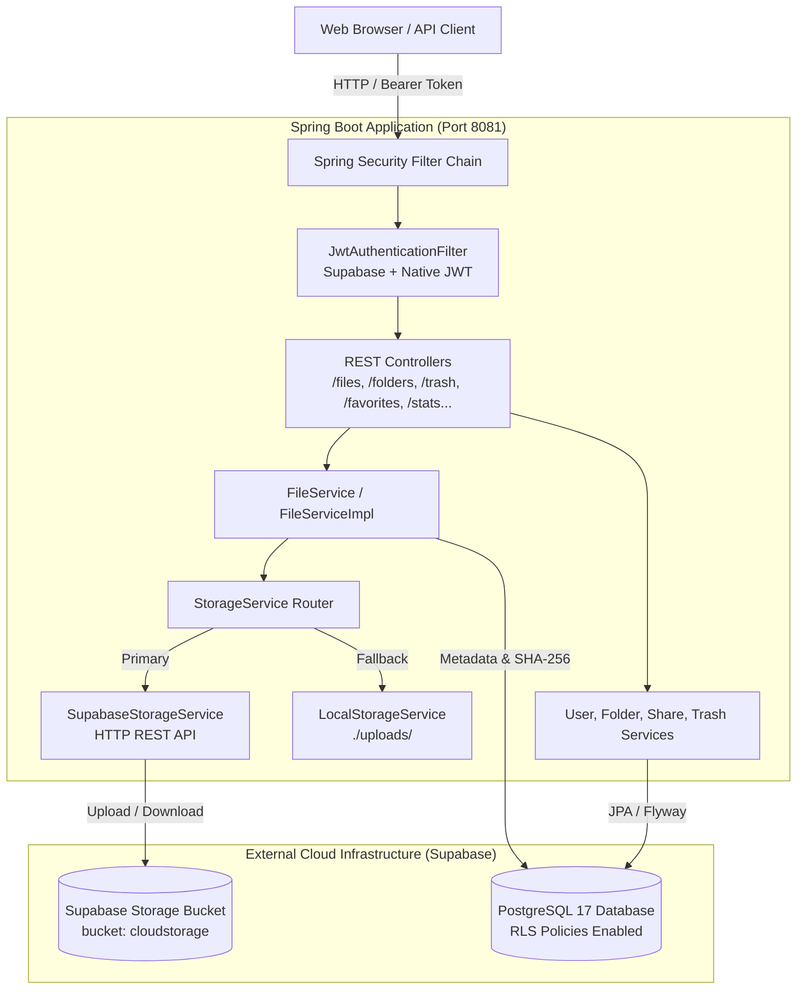
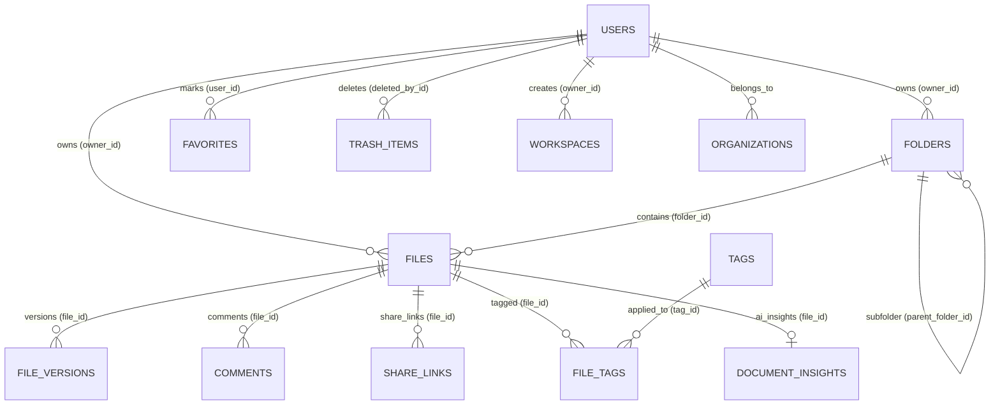

# Cloud File Storage System

[](https://openjdk.org/projects/jdk/17/)
[](https://spring.io/projects/spring-boot)
[](https://www.postgresql.org/)
[](https://supabase.com/)
[](LICENSE)

An enterprise-ready, multi-user cloud file storage and document management application built with **Spring Boot 3.5.13**, **PostgreSQL 17**, and **Supabase Storage**. The system features strict user data isolation enforced at the database layer via **PostgreSQL Row Level Security (RLS)**, dual authentication support (Supabase Auth and native Spring Security JWT), hierarchical folder structures, file versioning, public sharing links, storage quota analytics, and an integrated single-page web dashboard.

---

## Table of Contents

- [Overview](#overview)
- [Problem Statement](#problem-statement)
- [Key Features](#key-features)
- [Technology Stack](#technology-stack)
- [Architecture](#architecture)
- [Storage Implementation](#storage-implementation)
- [Database & Row Level Security (RLS)](#database--row-level-security-rls)
- [REST API Reference](#rest-api-reference)
- [File Lifecycle Flow](#file-lifecycle-flow)
- [Security Architecture](#security-architecture)
- [Project Structure](#project-structure)
- [Setup & Installation](#setup--installation)
- [Testing](#testing)
- [Future Improvements & Architecture Blueprints](#future-improvements--architecture-blueprints)

---

## Overview

The **Cloud File Storage System** provides a secure, reliable backend API and built-in web dashboard for managing private cloud files. Users can upload documents and media, organize them into folders, star favorites, soft-delete items into a recoverable trash bin, track file versions, generate password-protected public share links, and inspect real-time quota metrics categorized by file type.

Unlike generic storage solutions that rely exclusively on application-level filtering, this application implements a defense-in-depth model: user data isolation is enforced both in the Spring Boot service layer and directly within the **PostgreSQL database engine using Row Level Security (RLS)** and Supabase Storage bucket path policies.

---

## Problem Statement

When building multi-user file storage platforms, applications frequently suffer from common architectural flaws:

1. **Insecure Direct Object References (IDOR)**: Simply guessing or altering an object ID in API requests can expose another user's private documents if authorization is handled solely via ad-hoc queries.
2. **Coupling to Specific Cloud Providers**: Hardcoding proprietary cloud SDKs creates vendor lock-in and complicates local offline development.
3. **Loss of Storage Visibility**: Users have little to no visibility into what types of files consume their storage quota or whether files are duplicate or corrupted.
4. **Accidental Deletions**: Hard-deleting files immediately causes permanent data loss with no recovery path.

**How This System Solves It**:
- **Database-Level Isolation**: PostgreSQL RLS policies guarantee that even if an application query omits a user filter, the database rejects unauthorized access.
- **Pluggable Storage Abstraction**: A unified `StorageService` interface routes files either to **Supabase Storage** (primary cloud object storage) or **Local Disk** (offline development fallback).
- **Integrity Verification**: Automatic **SHA-256 checksums** computed on upload prevent data corruption and enable duplicate identification.
- **Two-Stage Deletion**: Soft-deletion moves items into an isolated Trash table with full restoration capabilities before permanent purging.

---

## Key Features

### 1. File & Folder Operations
- **File Upload & Hashing**: Multipart file uploads with automatic SHA-256 checksum generation, MIME type detection, and user quota tracking.
- **Hierarchical Folders**: Create nested folders with parent-child directory navigation and item move capabilities.
- **File Preview & Inline Streaming**: Inline binary delivery (`/files/view/{id}`) for documents, images, and media alongside attachment downloads (`/files/download/{id}`).
- **Bulk Operations**: Perform batch actions (`delete`, `favorite`, `move`) across multiple files simultaneously.

### 2. Data Isolation & Security
- **PostgreSQL Row Level Security (RLS)**: Enforced across `profiles`, `files`, `folders`, `workspaces`, `favorites`, `trash_items`, `tags`, and `storage.objects`.
- **Dual Authentication**:
  - **Supabase Auth**: Frontend sessions authenticate via Supabase Auth with automatic backend profile synchronization.
  - **Native Spring Security JWT**: Complete local auth suite (`/auth/register`, `/auth/login`, `/auth/refresh`, `/auth/forgot-password`, `/auth/reset-password`).
- **Owner-Scoped Access**: Every file and folder is strictly tied to the authenticated user's UUID.

### 3. File Versioning & Public Sharing
- **Version Tracking**: Maintains historical file iterations under `/files/{fileId}/versions` with single-click version restoration.
- **Share Links**: Create shareable tokens (`/public/share/{token}`) with optional expiration dates and BCrypt password protection.
- **Direct Resource Sharing**: Share files and folders directly with other registered users with granular permission roles (`VIEWER`, `EDITOR`, `ADMIN`).

### 4. Trash & Recovery Lifecycle
- **Soft Deletion**: Moving a file or folder to trash sets `deleted = true` and logs deletion timestamps without removing raw storage objects.
- **Selective Restore**: Restore individual files or folders back to their original directory locations.
- **Permanent Purge**: Permanently delete specific files or empty the entire trash bin, wiping database records and cloud storage objects.

### 5. Storage Analytics & Quota Management
- **Category Classification**: Storage statistics categorizes space usage across 7 major file types: **Documents**, **Images**, **Videos**, **Audio**, **Code**, **Archives**, and **Other**.
- **Real-Time Capacity Gauges**: Computes used bytes, free space, and percentage utilization against account limits.

### 6. Built-in Web Application
- **Zero-Dependency Static Client**: Served directly by Spring Boot from `src/main/resources/static/` (`index.html`, `style.css`, `script.js`).
- **Dedicated View Tabs**: Distinct dedicated pages for **All Files**, **Favorites**, and **Storage Analytics** with clean SVG vector iconography (no informal emojis).
- **Drag-and-Drop Staging**: Modern upload drop zone with file size formatting and staging confirmation.

### 7. Collaboration & Simulated Enterprise Services
- **Workspaces & Organizations**: Multi-tenant team structure supporting workspace members and role hierarchies.
- **File Comments & Tags**: Add color-coded tags and threaded comments to documents.
- **Simulated AI Services**: Mock endpoints for document summarization, action item extraction, interactive document chat, and OCR text extraction.
- **Simulated Stripe Billing**: Mock checkout session creation and webhook handling for subscription plans.

---

## Technology Stack

| Component | Technology | Version | Description |
| :--- | :--- | :--- | :--- |
| **Language** | Java | `17` (LTS) | Core backend programming language |
| **Framework** | Spring Boot | `3.5.13` | Application framework (`spring-boot-starter-web`, `data-jpa`, `security`, `validation`, `mail`) |
| **Security** | Spring Security + JJWT | `0.12.5` | Stateless JWT authentication, role authorization, BCrypt password hashing |
| **Database** | PostgreSQL | `17` (Supabase) | Primary relational database with Row Level Security |
| **Database Driver** | PostgreSQL JDBC | `42.7.10` | High-performance JDBC driver |
| **Connection Pool** | HikariCP | `6.3.3` | Production-grade JDBC connection pooling |
| **Migrations** | Flyway | `11.7.2` | Version-controlled database migrations (`V1` through `V4`) |
| **Cloud Storage** | Supabase Storage API | v1 REST | Cloud object storage bucket (`cloudstorage`) |
| **Local Storage** | Java NIO / Local Filesystem | N/A | Offline local fallback storage (`./uploads/`) |
| **Object Mapping** | MapStruct | `1.5.5.Final` | Compile-time DTO to Entity mapper |
| **Boilerplate** | Project Lombok | N/A | Getter/setter and builder code generation |
| **Config Loader** | Dotenv-Java | `3.0.0` | `.env` environment variables loader |
| **Testing** | JUnit 5 & Mockito | Spring Test 3.5 | Unit and context integration tests |
| **Frontend** | HTML5 / Vanilla CSS / Modern JS | Native | Clean, responsive single-page web dashboard |

> [!NOTE]
> **Cloud Provider Verification**: This project integrates with **Supabase Storage** and **Supabase PostgreSQL**. It does **NOT** use Azure Blob Storage, AWS S3 SDKs, or Kafka/Redis clusters in the current working codebase.

---

## Architecture

The system operates as a unified modular monolith following standard layered architecture principles:

```
[ Frontend Client (HTML5 / CSS / Vanilla JS) ]
                     │
                     ▼  (HTTP REST / Bearer JWT)
[ Security Filter Chain: JwtAuthenticationFilter ]
                     │
                     ▼
[ REST Controllers (22 Domain Controllers) ]
                     │
                     ▼
[ Service Layer (FileServiceImpl, UserService, etc.) ]
         │                                    │
         ▼                                    ▼
[ StorageService Interface ]      [ JPA Repositories (35 Repositories) ]
    ├── SupabaseStorageService                │
    └── LocalStorageService                   ▼
         │                        [ PostgreSQL 17 Database ]
         ▼                        (Row Level Security Enabled)
[ Cloud Storage / Local Disk ]
```

### Mermaid Architectural Diagram



---

## Storage Implementation

The storage layer is decoupled using the `StorageService` interface (`com.sohel.cloudstorage.storage.StorageService`):

```java
public interface StorageService {
    String uploadFile(MultipartFile file, String destinationPath) throws IOException;
    byte[] downloadFile(String path) throws IOException;
    boolean deleteFile(String path);
    boolean renameFile(String oldPath, String newPath);
}
```

### 1. Supabase Storage (`SupabaseStorageService`) - Primary Provider
- Marked with `@Primary` and `@Service`.
- **Upload**: Sends a `POST` request with the raw file bytes to `${app.supabase.url}/storage/v1/object/${app.supabase.bucket}/${objectKey}` using `java.net.http.HttpClient` with `x-upsert: true`.
- **Download**: Fetches authenticated bytes from `/storage/v1/object/authenticated/${app.supabase.bucket}/${objectKey}`.
- **Delete**: Sends a `DELETE` request with the JSON array of paths to `/storage/v1/object/${app.supabase.bucket}`.
- **Key Structure**: Files are stored under the pattern: `<user_uuid>/<random_uuid>_<filename>`.

### 2. Local Storage (`LocalStorageService`) - Local Fallback
- Activated when running offline or configured via `app.storage.type=local`.
- Uses Java NIO to write files directly to disk under `${app.storage.local.folder-path}` (defaults to `./uploads/`).
- Creates user-scoped subdirectories automatically (`./uploads/<user_uuid>/`).

### Required Storage Configuration
```properties
# Supabase Configuration
app.supabase.url=https://[YOUR-PROJECT-ID].supabase.co
app.supabase.key=[YOUR-SUPABASE-SERVICE-ROLE-OR-ANON-KEY]
app.supabase.bucket=cloudstorage

# Local Storage Fallback
app.storage.type=supabase
app.storage.local.folder-path=${user.dir}/uploads/
```

---

## Database & Row Level Security (RLS)

The database schema is managed via Flyway migrations (`src/main/resources/db/migration/`):
- `V1__baseline_schema.sql`: Core tables (`users`, `files`, `folders`, `file_activities`, `user_sessions`).
- `V2__phase5_features.sql`: Sharing and versioning (`file_versions`, `shared_resources`, `share_links`, `favorites`, `trash_items`, `tags`, `file_tags`, `comments`).
- `V3__phase7_saas_features.sql`: SaaS and enterprise tables (`organizations`, `teams`, `workspaces`, `subscriptions`, `plans`, `audit_logs`, `security_logs`, `document_insights`).
- `V4__supabase_auth_rls.sql`: Supabase Auth profile synchronization trigger, performance indexes, and **PostgreSQL Row Level Security (RLS)** policies.

### Row Level Security (RLS) Matrix

| Table | RLS Policy | Condition | Purpose |
| :--- | :--- | :--- | :--- |
| `profiles` | SELECT / UPDATE | `auth.uid() = id` | Users can only view and edit their own profile |
| `files` | SELECT / INSERT / UPDATE / DELETE | `auth.uid() = owner_id` | Complete file isolation between tenants |
| `folders` | SELECT / INSERT / UPDATE / DELETE | `auth.uid() = owner_id` | Folders strictly accessible by owner |
| `favorites` | SELECT / INSERT / DELETE | `auth.uid() = user_id` | Personal bookmarks only visible to user |
| `trash_items` | SELECT / INSERT / DELETE | `auth.uid() = deleted_by_id` | Trashed files isolated to the deleting user |
| `storage.objects` | SELECT / INSERT / UPDATE / DELETE | `(storage.foldername(name))[1] = auth.uid()::text` | Supabase Storage bucket access isolated per user folder |

### Entity Relationship Diagram



---

## REST API Reference

All protected endpoints require an `Authorization: Bearer <jwt-token>` header unless explicitly marked as public.

### 1. Authentication (`/auth`)

| Method | Endpoint | Description | Auth Required |
| :--- | :--- | :--- | :--- |
| `POST` | `/auth/register` | Register a new user account with email and password | No |
| `POST` | `/auth/login` | Authenticate with credentials and receive access + refresh JWTs | No |
| `POST` | `/auth/refresh` | Exchange a valid refresh token for a new access JWT | No |
| `GET` | `/auth/verify-email?token={token}` | Verify user email address | No |
| `POST` | `/auth/forgot-password` | Request password reset token via email | No |
| `POST` | `/auth/reset-password` | Set a new password using reset token | No |
| `POST` | `/auth/logout` | Revoke current refresh token and terminate session | No |

### 2. Files (`/files`)

| Method | Endpoint | Description | Auth Required |
| :--- | :--- | :--- | :--- |
| `POST` | `/files/upload` | Upload a file (`multipart/form-data`, optional `folderId`) | Yes |
| `GET` | `/files` | List active files (optional query param `?folderId={uuid}`) | Yes |
| `GET` | `/files/download/{id}` | Download file as an attachment (`Content-Disposition: attachment`) | Yes |
| `GET` | `/files/view/{id}` | Stream file inline (`Content-Type: application/octet-stream`) | Yes |
| `PUT` | `/files/{id}/favorite` | Toggle starred status of a file | Yes |
| `PUT` | `/files/{id}/rename?name={name}` | Rename an existing file | Yes |
| `POST` | `/files/{id}/move` | Move file to target folder (body: `{ "targetFolderId": "uuid" }`) | Yes |
| `POST` | `/files/bulk/{action}` | Execute batch action (`delete`, `favorite`, `move`) | Yes |
| `DELETE` | `/files/{id}` | Soft-delete file (moves to trash) | Yes |
| `GET` | `/files/favorites` | List all starred files | Yes |

### 3. Folders (`/folders`)

| Method | Endpoint | Description | Auth Required |
| :--- | :--- | :--- | :--- |
| `POST` | `/folders` | Create a folder (body: `CreateFolderRequest`) | Yes |
| `GET` | `/folders` | List folders (optional query param `?parentId={uuid}`) | Yes |
| `GET` | `/folders/{id}` | Get folder metadata by ID | Yes |
| `PUT` | `/folders/{id}` | Update folder name / color / icon | Yes |
| `PUT` | `/folders/{id}/favorite` | Toggle favorite status for folder | Yes |
| `POST` | `/folders/{id}/move` | Move folder into another parent folder | Yes |
| `DELETE` | `/folders/{id}` | Delete folder and move items to trash | Yes |
| `GET` | `/folders/favorites` | List favorite folders | Yes |

### 4. Trash & Recovery (`/trash`)

| Method | Endpoint | Description | Auth Required |
| :--- | :--- | :--- | :--- |
| `GET` | `/trash/files` | List soft-deleted files | Yes |
| `GET` | `/trash/folders` | List soft-deleted folders | Yes |
| `POST` | `/trash/files/{id}/restore` | Restore soft-deleted file | Yes |
| `POST` | `/trash/folders/{id}/restore` | Restore soft-deleted folder | Yes |
| `DELETE` | `/trash/files/{id}` | Permanently delete file from DB & Storage | Yes |
| `DELETE` | `/trash/folders/{id}` | Permanently delete folder | Yes |
| `DELETE` | `/trash/empty` | Empty trash (purges all user trashed items) | Yes |

### 5. Storage Statistics (`/stats`)

| Method | Endpoint | Description | Auth Required |
| :--- | :--- | :--- | :--- |
| `GET` | `/stats/storage` | Retrieve user storage quota, usage percentage, and file category breakdown | Yes |

### 6. File Versions (`/files/{fileId}/versions`)

| Method | Endpoint | Description | Auth Required |
| :--- | :--- | :--- | :--- |
| `GET` | `/files/{fileId}/versions` | List historical versions of a file | Yes |
| `POST` | `/files/{fileId}/versions/{versionNumber}/restore` | Restore file to a previous version | Yes |
| `DELETE` | `/files/{fileId}/versions/{versionId}` | Delete a specific historical version | Yes |

### 7. Public Sharing & Links (`/shares`, `/share-links`, `/public`)

| Method | Endpoint | Description | Auth Required |
| :--- | :--- | :--- | :--- |
| `POST` | `/shares` | Share resource with user email (`ShareResourceRequest`) | Yes |
| `GET` | `/shared-with-me` | List files/folders shared with current user | Yes |
| `GET` | `/shared-by-me` | List resources shared by current user | Yes |
| `POST` | `/share-links` | Generate public share link token with optional password | Yes |
| `GET` | `/public/share/{token}` | Access shared resource metadata | No |
| `GET` | `/public/share/{token}/file` | Access public shared file content | No |
| `DELETE` | `/share-links/{id}` | Revoke and disable an active share link | Yes |

### 8. Workspaces, Organizations & Teams (`/workspaces`, `/organizations`)

| Method | Endpoint | Description | Auth Required |
| :--- | :--- | :--- | :--- |
| `POST` | `/organizations` | Create an organization | Yes |
| `GET` | `/organizations` | List organizations user belongs to | Yes |
| `POST` | `/workspaces` | Create collaborative workspace | Yes |
| `GET` | `/workspaces` | List user workspaces | Yes |
| `POST` | `/workspaces/{id}/members` | Add member to workspace by email | Yes |
| `DELETE` | `/workspaces/{id}/members` | Remove member from workspace | Yes |

### 9. Tags & Comments (`/tags`, `/comments`)

| Method | Endpoint | Description | Auth Required |
| :--- | :--- | :--- | :--- |
| `POST` | `/tags` | Create a custom tag | Yes |
| `GET` | `/tags` | List all user tags | Yes |
| `POST` | `/tags/files/{fileId}/{tagId}` | Attach tag to a file | Yes |
| `DELETE` | `/tags/files/{fileId}/{tagId}` | Detach tag from a file | Yes |
| `POST` | `/comments` | Add comment on a file | Yes |
| `GET` | `/comments?fileId={uuid}` | List comments on a file | Yes |

### 10. User Profile & Admin (`/users`, `/admin`)

| Method | Endpoint | Description | Auth Required |
| :--- | :--- | :--- | :--- |
| `GET` | `/users/me` | Get current authenticated user profile | Yes |
| `PUT` | `/users/profile` | Update profile information | Yes |
| `PUT` | `/users/password` | Change user password | Yes |
| `GET` | `/users/sessions` | View active login sessions | Yes |
| `DELETE` | `/users/sessions/{id}` | Revoke a specific session | Yes |
| `GET` | `/admin/dashboard` | Administrative overview statistics | Role: `ADMIN` |
| `GET` | `/admin/users` | List paginated users | Role: `ADMIN` |
| `PUT` | `/admin/users/{email}/disable` | Disable user account | Role: `ADMIN` |
| `PUT` | `/admin/users/{email}/enable` | Enable user account | Role: `ADMIN` |
| `GET` | `/admin/audit` | View paginated audit logs | Role: `ADMIN` |

### 11. Simulated AI & Billing Services (`/ai`, `/billing`)

| Method | Endpoint | Description | Auth Required |
| :--- | :--- | :--- | :--- |
| `POST` | `/ai/files/{fileId}/summarize` | AI document summarization simulation | Yes |
| `POST` | `/ai/files/{fileId}/action-items`| Action items extraction simulation | Yes |
| `POST` | `/ai/files/{fileId}/chat` | Interactive document Q&A simulation | Yes |
| `POST` | `/ai/files/{fileId}/ocr` | Image text extraction simulation | Yes |
| `POST` | `/ai/files/{fileId}/insights` | Generate document insight entity | Yes |
| `POST` | `/billing/organizations/{id}/checkout` | Stripe checkout session simulation | Yes |
| `POST` | `/billing/webhook/stripe` | Stripe webhook event handler simulation | No |

---

## File Lifecycle Flow

### 1. Upload Lifecycle
1. **Client Request**: Client submits a `multipart/form-data` request with the file to `POST /files/upload`.
2. **Authentication & Identity**: `JwtAuthenticationFilter` resolves user identity (via native JWT subject or Supabase token `sub` / `email`).
3. **Validation & Checksum**: `FileServiceImpl` validates file presence, sanitizes filename spaces, extracts the extension, and calculates a **SHA-256 checksum**.
4. **Physical Object Storage**: `StorageService` sends raw bytes to Supabase Storage bucket `cloudstorage` under key `<user_uuid>/<unique_filename>`.
5. **Metadata Persistence**: `FileEntity` is persisted in PostgreSQL with name, size, MIME type, storage path, public URL, checksum, and owner foreign key.
6. **Quota Update**: User's `storage_used` metric is incremented by file size in bytes.

### 2. Download Lifecycle
1. Client requests `GET /files/download/{id}`.
2. Service verifies that the file exists and is owned by the authenticated user (`findByIdAndOwner`).
3. Service updates `lastOpenedAt` timestamp in PostgreSQL.
4. `StorageService` fetches raw bytes from Supabase Storage (or local disk).
5. Spring Boot responds with byte array and `Content-Disposition: attachment; filename="..."`.

### 3. Soft-Delete & Permanent Purge Lifecycle
- **Soft Delete (`DELETE /files/{id}`)**: Marks `deleted = true` and records `deletedAt = NOW()`. The file immediately disappears from active listings but remains in physical storage.
- **Restore (`POST /trash/files/{id}/restore`)**: Resets `deleted = false` and clears `deletedAt`.
- **Permanent Purge (`DELETE /trash/files/{id}`)**: Deletes `FileEntity` row from PostgreSQL, deletes object from Supabase Storage bucket, and decrements user's `storage_used` bytes.

---

## Security Architecture

1. **Defense-in-Depth Data Isolation**:
   - Application Layer: Every database query enforces ownership (`findByIdAndOwner(fileId, user)`).
   - Database Layer: PostgreSQL RLS prevents cross-tenant access even if SQL queries bypass ownership filters.
2. **Stateless JWT Security**:
   - Native JJWT with HMAC-SHA256 (`Keys.hmacShaKeyFor`) and configurable expiration.
   - Dual support for Supabase Auth JWTs (ES256 / HS256) with claim parsing and expiration verification.
3. **Password Security**:
   - All passwords hashed using standard **BCrypt** (`BCryptPasswordEncoder`).
4. **CORS & CSRF Configuration**:
   - Stateless REST API architecture (`SessionCreationPolicy.STATELESS`) with CSRF disabled for API endpoints.
5. **No Secrets in Source Control**:
   - Sensitive credentials (`SPRING_DATASOURCE_PASSWORD`, `SUPABASE_KEY`) are managed exclusively via environment variables or git-ignored `.env` files.

---

## Project Structure

```
cloudstorage/
├── .env.example                               # Environment configuration template
├── architecture.mermaid                       # System architecture diagram
├── ER_diagram.mermaid                         # Database entity relationship diagram
├── pom.xml                                    # Maven dependencies & build configuration
├── src/
│   ├── main/
│   │   ├── java/com/sohel/cloudstorage/
│   │   │   ├── CloudstorageApplication.java   # Main Spring Boot entrypoint
│   │   │   ├── constants/                     # Application error & response constants
│   │   │   ├── controller/                    # 22 REST API Controllers
│   │   │   ├── dto/                           # Request & Response Data Transfer Objects
│   │   │   ├── entity/                        # 35 JPA Entities
│   │   │   ├── enums/                         # Status, Role, and Type Enums
│   │   │   ├── exception/                     # GlobalExceptionHandler & custom exceptions
│   │   │   ├── mapper/                        # MapStruct Entity-DTO Mappers
│   │   │   ├── repository/                    # 35 Spring Data JPA Repositories
│   │   │   ├── security/                      # Spring Security, JWT Filter & Auth Handlers
│   │   │   ├── service/                       # Service interfaces and implementations
│   │   │   └── storage/                       # StorageService, Supabase & Local implementations
│   │   └── resources/
│   │       ├── application.yml                # Base application config (default port: 8081)
│   │       ├── application-dev.yml            # Dev profile (Datasource, Supabase credentials)
│   │       ├── db/migration/                  # Flyway database migration scripts (V1-V4)
│   │       └── static/                        # Frontend Single Page Web Dashboard
│   │           ├── index.html                 # UI markup (All Files, Favorites, Stats)
│   │           ├── style.css                  # UI Design System & Styling
│   │           └── script.js                  # Frontend Controller & Supabase Auth Client
│   └── test/
│       └── java/com/sohel/cloudstorage/
│           └── CloudstorageApplicationTests.java  # Spring Boot Context Test
└── uploads/                                   # Local disk storage folder (git-ignored)
```

---

## Setup & Installation

### Prerequisites

- **Java JDK**: Version `17` or higher (`java -version`).
- **Maven**: Version `3.9+` (or use the included `./mvnw` wrapper).
- **PostgreSQL Database**: Supabase PostgreSQL database (or local PostgreSQL 14+ instance).
- **Supabase Account**: A Supabase project with an active Storage bucket named `cloudstorage`.

### 1. Clone the Repository
```bash
git clone https://github.com/ShaikSohel1/cloud-file-storage-system.git
cd cloud-file-storage-system
```

### 2. Configure Environment Variables
Copy `.env.example` to create your local `.env` file:
```bash
cp .env.example .env
```

Configure your credentials in `.env`:
```properties
# PostgreSQL Database Configuration
SPRING_DATASOURCE_URL=jdbc:postgresql://aws-0-ap-southeast-1.pooler.supabase.com:5432/postgres?sslmode=require
SPRING_DATASOURCE_USERNAME=postgres.[YOUR_PROJECT_REF]
SPRING_DATASOURCE_PASSWORD="YOUR_DATABASE_PASSWORD"

# Supabase Storage Configuration
SUPABASE_URL=https://[YOUR_PROJECT_REF].supabase.co
SUPABASE_KEY=[YOUR_SUPABASE_SERVICE_ROLE_OR_ANON_KEY]
SUPABASE_BUCKET=cloudstorage

# Storage Mode (supabase or local)
STORAGE_TYPE=supabase
```

### 3. Build the Application
```bash
./mvnw clean compile
```

### 4. Run the Application
```bash
./mvnw spring-boot:run
```
*By default, the server runs on port **`8081`** to avoid port collisions with other local services.*

### 5. Access the Web Dashboard & API
- **Web Application Dashboard**: Open your browser at **[http://localhost:8081/](http://localhost:8081/)**
- **REST API Base URL**: `http://localhost:8081/api` (or direct controller paths `/files`, `/auth`, etc.)

---

## Testing

The project includes unit and context integration tests using **JUnit 5** and **Spring Boot Test**.

To execute tests:
```bash
SPRING_DATASOURCE_PASSWORD="YOUR_DATABASE_PASSWORD" ./mvnw test
```

> [!IMPORTANT]
> **Database Credentials During Tests**:
> Because `.env` is loaded programmatically inside `main()`, executing tests from the command line (`./mvnw test`) requires providing `SPRING_DATASOURCE_PASSWORD` as an environment variable so the Spring test context loader can connect and validate Flyway migrations.
>
> **Actual Test Suite Result**:
> ```
> [INFO] Running com.sohel.cloudstorage.CloudstorageApplicationTests
> [INFO] Tests run: 1, Failures: 0, Errors: 0, Skipped: 0
> [INFO] BUILD SUCCESS
> ```

---

## Future Improvements & Architecture Blueprints

The repository includes exploratory infrastructure files (`docker-compose-enterprise.yml`, `/k8s`, `/terraform`) that outline potential future distributed scaling paths. These are **architectural blueprints** rather than the current runtime architecture:

- **Microservice Decomposition**: Splitting the Spring Boot monolith into independent domain services (Auth Service, File Worker, Billing Service).
- **Asynchronous Event Streaming**: Introducing Apache Kafka or RabbitMQ for decoupled asynchronous document indexing and thumbnail generation.
- **Distributed Caching**: Adding Redis caching for hot metadata and session verification.
- **Production Kubernetes Deployments**: Full containerization and Helm charts for cloud-agnostic orchestrations.